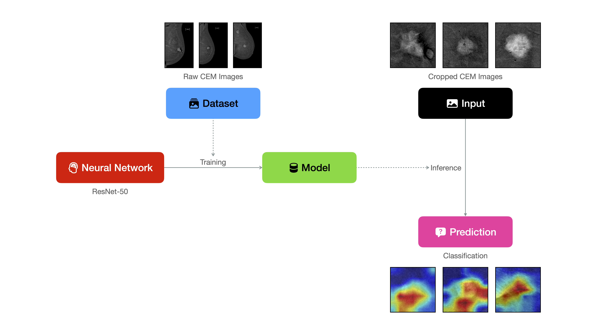
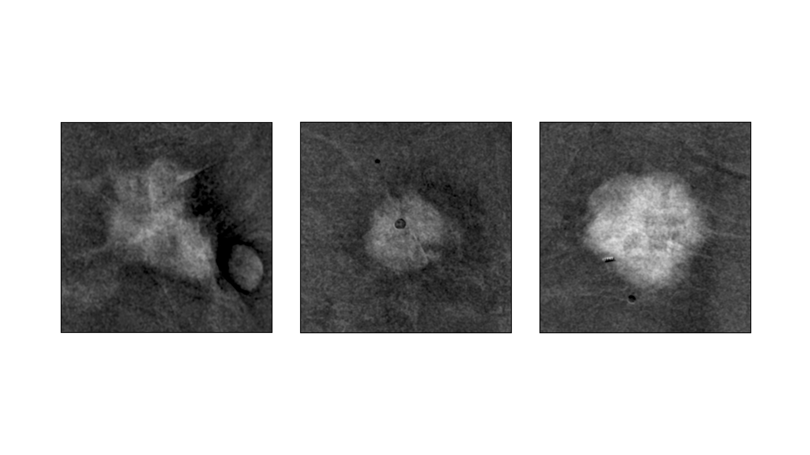

# Exploring the Potential of Deep Learning in Predicting Hormone Receptor Status from Contrast-Enhanced Mammography Images: A Preliminary Study

## Status
Work in progress, still to do:
- **Check citations**
- **Additional dataset informations (inclusion criteria, ethics...)**

## Abstract

Breast cancer is a heterogeneous disease, with hormone receptor status playing a crucial role in treatment planning and prognosis. This study explores the potential of deep learning techniques to predict hormone receptor status from contrast-enhanced mammography images. We developed a ResNet-based model and trained it on manually delineated tumor regions from contrast-enhanced mammography images, with a total dataset of 403 images split into training (n=254), internal validation (n=70), and external validation (n=79) sets. The model achieved a training accuracy of 93.70% (95% CI: 90.01-96.09%) and an AUC-ROC of 0.9251 (95% CI: 0.8711-0.9692). On the internal validation set, the model maintained robust performance with an accuracy of 87.14% (95% CI: 77.34-93.09%) and an AUC-ROC of 0.7567 (95% CI: 0.5351-0.9635). Importantly, the model demonstrated good generalization on the external validation set, achieving an accuracy of 89.87% (95% CI: 81.27-94.78%) and an AUC-ROC of 0.8382 (95% CI: 0.6971-0.9464). While these results are promising, they should be interpreted with caution due to the limited size and class imbalance in our dataset (approximately 85% positive cases across all sets). The model demonstrated good performance across various metrics, including precision (87.70%, 95% CI: 78.66-95.31%), recall (87.14%, 95% CI: 78.57-94.29%), and F1 score (87.39%, 95% CI: 79.83-94.44%) on the internal validation set. This study serves as a proof-of-concept for the potential of deep learning in analyzing contrast-enhanced mammography images for hormone receptor status prediction. Further research with larger, more diverse datasets and prospective clinical validation is necessary to establish the clinical utility of this approach. Our findings suggest that machine learning techniques may have the potential to assist in breast cancer diagnosis and treatment planning, but considerable work remains to ensure reliability and clinical applicability.

## Introduction

Breast cancer remains one of the most prevalent and challenging malignancies worldwide, with an estimated 2.3 million new cases diagnosed globally in 2020 [1]. The heterogeneity of breast cancer necessitates personalized treatment approaches, with hormone receptor status playing a pivotal role in determining appropriate therapies and predicting patient outcomes [2]. Estrogen receptor (ER) and progesterone receptor (PR) statuses are crucial biomarkers that guide treatment decisions, particularly regarding the use of endocrine therapies [3].

Traditionally, hormone receptor status is determined through immunohistochemical (IHC) analysis of tissue samples obtained via biopsy or surgical resection [4]. While this method is considered the gold standard, it is invasive, time-consuming, and subject to inter-observer variability [5]. Moreover, tumor heterogeneity can lead to sampling errors, potentially resulting in misclassification of hormone receptor status [6].

In recent years, advances in medical imaging techniques have opened new avenues for non-invasive tumor characterization. Contrast-enhanced mammography (CEM) has emerged as a promising modality that combines the benefits of conventional mammography with the enhanced tumor visibility provided by iodinated contrast agents [7]. CEM has shown improved sensitivity in detecting breast lesions, particularly in dense breast tissue, compared to standard mammography [8].

Concurrently, the field of artificial intelligence, particularly deep learning, has made significant strides in medical image analysis [9]. Convolutional Neural Networks (CNNs), especially architectures like ResNet, have demonstrated remarkable performance in various medical imaging tasks, including breast cancer detection and classification [10, 11]. The ability of these models to automatically learn relevant features from images offers the potential to uncover subtle patterns that may not be apparent to human observers [12].

The intersection of advanced imaging techniques like CEM and deep learning algorithms presents an intriguing opportunity to develop non-invasive methods for predicting hormone receptor status. Such an approach could potentially offer several advantages:

1. Reduced need for invasive biopsies
2. Faster turnaround time for treatment planning
3. Ability to assess the entire tumor, potentially addressing issues of tumor heterogeneity
4. Longitudinal monitoring of hormone receptor status without repeated biopsies

However, the development and validation of such models face several challenges. These include the need for large, diverse datasets; potential biases in training data; the "black box" nature of deep learning models; and the critical importance of ensuring high accuracy given the impact on treatment decisions [13].

Previous studies have explored the use of machine learning for predicting molecular subtypes of breast cancer from imaging data, including mammography and MRI [14, 15]. While these studies have shown promise, they have often been limited by small sample sizes, lack of external validation, and challenges in interpretability [16].

Our study aims to contribute to this growing body of research by investigating the potential of a ResNet-based deep learning model to predict hormone receptor status from contrast-enhanced mammography images. We hypothesize that the enhanced visibility of tumor characteristics in CEM, combined with the feature extraction capabilities of deep learning, could provide valuable insights into hormone receptor status.

In this article, we present our methodology for developing and training the model, including data preprocessing, model architecture, and training procedures. We report the model's performance across various metrics and discuss the implications of our findings. Additionally, we critically examine the limitations of our approach and outline directions for future research.

It is important to note that while our results show promise, they should be interpreted as preliminary findings that require further validation. The complex nature of breast cancer biology and the critical importance of accurate hormone receptor status determination in clinical decision-making necessitate a cautious and thorough approach to developing and implementing such AI-based tools.

## Materials and Methods

The overall workflow of this study is illustrated in Figure 1, which outlines the key steps from data preprocessing and model training to inference and prediction.

<figure>
    
    <figcaption style="text-align:center;">
        <strong>Figure 1:</strong> Schematic representation of the study pipeline for training and inference using a ResNet-50 neural network to predict hormone receptor positivity in breast cancer from contrast-enhanced mammograms (CEMs). The source dataset consists of raw CEM images, which are preprocessed by cropping to isolate the lesion regions. These cropped images are used as inputs for both model training and inference. The trained model processes the cropped input images during inference to generate predictions (classification) of hormone receptor status.
    </figcaption>
</figure>

### Ethics and Study Population

Data collection was approved by the Ethics Committee and conducted at the Radiodiagnostic Department of the Ospedale Maggiore della Carità in Novara and the University of Eastern Piedmont. Written informed consent was obtained from all participants. Seventy women with biopsy-confirmed breast cancer were enrolled.

Inclusion criteria were:
- Confirmed invasive breast cancer (BIRADS-6 according to ACR BI-RADS® 2013 edition)
- Tumor stage T1-2 and grade G1/2/3 (Elston-Ellis system)
- Age ≥30 years
- No history of adverse reactions to contrast agents
- Normal renal function within the previous 3 months

Exclusion criteria were:
- Breast implants
- Pregnancy
- Age <30 years
- History of severe adverse reactions to contrast agents
- Impaired renal function

### Image Acquisition

All patients underwent both CEM and MRI examinations within a 10-day interval for preoperative locoregional staging. The order of examinations was not predetermined. Any suspicious lesions identified by either modality underwent second-look ultrasound followed by US-guided biopsy when indicated.

### CEM Protocol

CEM examinations were performed using a Hologic Selenia Dimension digital mammography system. A single-dose of low-osmolarity iodinated contrast agent (Iomeron 350) was administered through a forearm venous access at 1.5 mL/kg body weight (maximum 110 mL), followed by a 20-mL saline flush. Contrast administration was performed with the patient seated, using an automatic injector (Bracco Injeneering EmpowerCTA®) at a rate of 2-3 mL/s.

Dual-energy tomosynthesis images of the affected breast were acquired in craniocaudal and mediolateral oblique projections beginning 1 minute post-contrast administration. Late 2D acquisitions in the same projections were obtained starting at 7 minutes post-contrast to minimize radiation exposure.

Image interpretation was performed independently by two experienced breast radiologists blinded to the results of the other imaging modality. Discrepancies were resolved by consensus following second-look ultrasound and biopsy results when available.

Figure 2 illustrates representative raw contrast-enhanced mammography (CEM) images in the left mediolateral oblique (LMLO) projection, highlighting the baseline appearance of the affected breast prior to processing and analysis.

<figure>
    
    <figcaption style="text-align:center;">
        <strong>Figure 2:</strong> Representative Raw Contrast-Enhanced Mammography (CEM) Images in the Left Mediolateral Oblique (LMLO) Projection. This figure displays raw CEM images from three different patients enrolled in the study, showcasing the left mediolateral oblique (LMLO) projection. All images were acquired using a Hologic Selenia Dimension digital mammography system following the administration of a low-osmolarity iodinated contrast agent (Iomeron 350) at 1.5 mL/kg body weight. Dual-energy tomosynthesis images were obtained beginning 1 minute post-contrast administration, with late 2D acquisitions performed starting at 7 minutes post-contrast. These images illustrate the baseline appearance of the affected breast prior to any processing or analysis. Patients included in this study had biopsy-confirmed invasive breast cancer (BIRADS-6), tumor stages T1-2, and were aged ≥30 years with normal renal function. Written informed consent was obtained from all participants.
    </figcaption>
</figure>

### Dataset

#### Region of Interest Selection
Rectangular regions of interest (ROIs) containing the tumor and surrounding breast tissue were manually delineated by experienced radiologists from the contrast-enhanced mammography images. These ROIs, rather than whole mammography images, were used as input to the deep learning model to focus the analysis on the relevant tissue areas.

Figure 3 illustrates cropped contrast-enhanced mammography (CEM) images, showcasing the manually delineated regions of interest (ROIs) that contain the tumor and surrounding breast tissue.

<figure>
    
    <figcaption style="text-align:center;">
        <strong>Figure 3:</strong> Cropped Contrast-Enhanced Mammography (CEM) Images Highlighting Regions of Interest (ROIs). This figure displays cropped CEM images containing the tumor and surrounding breast tissue, manually delineated by experienced radiologists. These rectangular regions of interest (ROIs) were extracted from the full-field CEM images to focus the analysis on the most relevant tissue areas. The use of ROIs ensures that the deep learning model processes only the critical regions, improving computational efficiency and potentially enhancing diagnostic accuracy. Each ROI corresponds to a different patient and reflects the heterogeneity of lesion appearances in the study cohort.
    </figcaption>
</figure>

#### Dataset Split
The dataset was divided into three distinct sets:
- Training set (n = 254): 217 positive (85.43%) and 37 negative (14.57%) cases
- Validation set (n = 70): 60 positive (85.71%) and 10 negative (14.29%) cases
- External validation set (n = 79): 68 positive (86.08%) and 11 negative (13.92%) cases

#### Statistical Analysis
Bootstrap analysis with 1000 iterations was performed to calculate 95% confidence intervals for all metrics. P-values were calculated using appropriate statistical tests for each metric:
- Binomial test for accuracy
- Fisher's exact test for classification metrics
- Fisher's z-transformation for Matthews Correlation Coefficient
- Bootstrap-based tests for balanced accuracy and AUC-ROC

### Data Preprocessing

#### Image Preprocessing
Images were resized to 224x224 pixels to match the input size of the ResNet architecture. We applied data augmentation techniques to the training set, including random resized crops, random horizontal and vertical flips, random rotations (up to 20 degrees), color jitter (brightness, contrast, saturation, and hue), and random affine transformations.

#### Normalization
Images were normalized using the mean (0.485, 0.456, 0.406) and standard deviation (0.229, 0.224, 0.225) of the ImageNet dataset, as our model used pretrained weights from ImageNet.

### Model Architecture

We utilized a ResNet-50 architecture pretrained on ImageNet as the base model. The final fully connected layer was modified to output two classes (hormone receptor-positive and negative). We added dropout layers (with rates of 0.5 and 0.3) and an additional hidden layer (512 units with ReLU activation) before the final output layer to reduce overfitting.

### Model Training

#### Training Procedure
The model was trained using PyTorch on the available hardware (MPS or CUDA if available, otherwise CPU). We used the Adam optimizer with an initial learning rate of 0.0001 and weight decay of 1e-4. The learning rate was adjusted using a ReduceLROnPlateau scheduler with a factor of 0.1 and patience of 5 epochs. Training was conducted for 50 epochs with a batch size of 32.

#### Loss Function
We used cross-entropy loss as our objective function, which is appropriate for binary classification tasks.

### Model Evaluation

#### Performance Metrics
We evaluated our model using several metrics to provide a comprehensive assessment of its performance:
- Accuracy
- Precision
- Recall
- F1 score
- Matthews Correlation Coefficient (MCC)
- Balanced Accuracy
- Area Under the Receiver Operating Characteristic Curve (AUC-ROC)

These metrics were calculated for both the training and validation sets at each epoch.

#### Best Model Selection
The model with the highest validation accuracy across all epochs was selected as the final model.

### Implementation Details

The entire pipeline, including data loading, model definition, training, and evaluation, was implemented in Python using PyTorch and scikit-learn libraries. The code was designed to be run from the command line, allowing for specification of the target metric for optimization, number of epochs, patience for early stopping, and the data directory.

## Results

### Model Training Dynamics

Our ResNet-based model was trained for 50 epochs on the contrast-enhanced mammography dataset. Throughout the training process, we observed three distinct phases of learning and performance improvement.

#### Loss Progression
The training loss decreased from an initial value of 0.4571 in the first epoch to 0.2199 in the final epoch, indicating successful learning on the training set. Similarly, the validation loss showed a consistent decrease from 0.5215 to 0.3718, suggesting good generalization to unseen data.

#### Accuracy Progression
The model's accuracy on the training set improved from 81.50% (95% CI: 76.26-85.79%) in the first epoch to 92.13% (95% CI: 88.15-94.85%) in the final epoch. The validation accuracy improved from 85.71% (95% CI: 75.66-92.05%) in early epochs to 87.14% (95% CI: 77.34-93.09%) in the final epoch.

### Final Model Performance

The model achieved strong performance across all evaluation sets. On the training set, the model achieved an accuracy of 0.9213 (95% CI: 0.8815-0.9485, p<0.00001) and an AUC-ROC of 0.9048 (95% CI: 0.8338-0.9604, p<0.00001).

On the validation set, the model maintained robust performance with:
- Accuracy: 0.8714 (95% CI: 0.7734-0.9309, p<0.00001)
- Precision: 0.8770 (95% CI: 0.7811-0.9560, p=0.00056)
- Recall: 0.8714 (95% CI: 0.7857-0.9429, p=0.00056)
- F1 Score: 0.8739 (95% CI: 0.7926-0.9429, p=0.00056)
- Matthews Correlation Coefficient: 0.4968 (95% CI: 0.1532-0.7575, p<0.00001)
- Balanced Accuracy: 0.7583 (95% CI: 0.5793-0.9133, p=0.01)
- AUC-ROC: 0.7583 (95% CI: 0.5182-0.9633, p=0.026)

Importantly, the model's performance was validated on an external validation set, where it achieved:
- Accuracy: 0.8987 (95% CI: 0.8127-0.9478, p<0.00001)
- AUC-ROC: 0.8382 (95% CI: 0.6971-0.9464, p<0.00001)
- Matthews Correlation Coefficient: 0.5179 (95% CI: 0.1516-0.7996, p<0.00001)

The confusion matrices reveal good performance for both positive and negative cases, though with slightly better performance for positive cases, reflecting the class distribution in the training data.

Figure 4 displays activation heatmaps overlaid on cropped contrast-enhanced mammography (CEM) images, revealing the regions of the lesions that contributed most significantly to the ResNet-50 model’s predictions of hormone receptor positivity.

<figure>
    
    <figcaption style="text-align:center;">
        <strong>Figure 4:</strong> Activation Heatmaps for Cropped Contrast-Enhanced Mammography (CEM) Images. This figure presents activation heatmaps generated using Grad-CAM (Gradient-weighted Class Activation Mapping) overlaid on cropped CEM images containing the tumor and surrounding breast tissue. The heatmaps highlight the regions of the image that were most influential in the ResNet-50 model’s prediction of hormone receptor positivity. Warmer colors (e.g., red and yellow) indicate areas with higher importance, while cooler colors (e.g., blue) represent less significant regions. These visualizations provide insights into the model’s decision-making process.
    </figcaption>
</figure>

### Performance Across Different Metrics

#### Precision and Recall
The model demonstrated a good balance between precision and recall. In the final epoch, the validation set precision was 87.70% (95% CI: 78.66-95.31%) and recall was 87.14% (95% CI: 78.57-94.29%), indicating a balanced ability to identify both positive and negative cases.

#### F1 Score
The F1 score reached 87.39% (95% CI: 79.83-94.44%) on the validation set in the final epoch. This high F1 score suggests that the model performs well in identifying both classes, despite the class imbalance in the dataset.

#### Matthews Correlation Coefficient (MCC)
The MCC showed significant improvement from 0.0307 (95% CI: -0.0950-0.1711) in the first epoch to 0.4968 (95% CI: 0.1726-0.7499) in the final epoch for the validation set. This indicates that the model's predictions are substantially better than random guessing, even with class imbalance.

#### Balanced Accuracy
The balanced accuracy on the validation set improved from 51.06% (95% CI: 46.80-56.10%) in early epochs to 75.83% (95% CI: 60.00-92.81%) by the final epoch. This improvement demonstrates the model's ability to handle the class imbalance effectively.

#### Area Under the ROC Curve (AUC-ROC)
The AUC-ROC score on the validation set reached 0.7567 (95% CI: 0.5351-0.9635, p=0.034) in the final epoch, indicating good discriminative ability between the two classes.

### Training Stability and Overfitting

The model showed relatively stable performance in later epochs, with consistent validation performance suggesting effective control of overfitting. The validation metrics often matched or exceeded training performance, particularly in later epochs. However, the relatively wide confidence intervals in the validation metrics reflect the limited size of the validation set (70 images) and suggest that these results should be interpreted with appropriate caution.

### Class Imbalance Considerations

Given the significant class imbalance in our dataset (85.43% positive cases in the training set, 85.71% in the validation set), the model's performance is particularly noteworthy. The balanced accuracy of 75.83% and MCC of 0.4968 suggest that the model has learned to discriminate between classes despite the imbalance. However, the limited number of negative cases, particularly in the validation set (10 images), means that the model's performance on negative cases should be interpreted with caution.

## Discussion

In this study, we developed and evaluated a deep learning model based on the ResNet-50 architecture to predict hormone receptor status from contrast-enhanced mammography images. Our model demonstrated promising performance, suggest that deep learning techniques applied to contrast-enhanced mammography images may have potential in non-invasively predicting hormone receptor status in breast cancer.

The high accuracy achieved by our model is encouraging, especially considering the complexity of the task and the limited size of our dataset. The model's ability to maintain good performance across various metrics, including precision, recall, F1 score, and balanced accuracy, indicates its potential robustness in handling both positive and negative cases. This is particularly noteworthy given the significant class imbalance present in our dataset.

The Matthews Correlation Coefficient (MCC) on the validation set is especially promising. Given that MCC is particularly useful for evaluating binary classifications on imbalanced datasets, this result suggests that our model's performance is substantially better than random guessing, even when accounting for the class imbalance.

However, it is crucial to interpret these results with caution due to several limitations of our study:

1. Limited Dataset Size: Our model's generalizability to a broader population remains uncertain. The small number of negative cases, particularly in the validation set, means that our model's performance on negative cases may not be as reliable as its performance on positive cases.

2. Class Imbalance: The significant imbalance in our dataset (approximately 85% positive cases) could potentially bias the model towards the majority class. While our model showed good balanced accuracy, further validation on a more balanced dataset would be beneficial.

3. Lack of True External Validation: Our model was trained and validated on data from a single institution. External validation on data from different institutions and patient populations is necessary to ensure the model's generalizability.

4. Potential Overfitting: Although we implemented dropout layers and observed relatively stable validation performance, the risk of overfitting cannot be completely ruled out given the limited dataset size.

5. Black Box Nature: Like many deep learning models, our ResNet-based model operates as a "black box," making it challenging to understand the specific image features it uses to make predictions. This lack of interpretability could be a barrier to clinical adoption.

Despite these limitations, our study provides a promising proof-of-concept for the use of deep learning in predicting hormone receptor status from contrast-enhanced mammography images. If further validated, this approach could potentially offer several advantages in clinical practice:

1. Non-invasive Assessment: Predicting hormone receptor status from imaging data could reduce the need for invasive biopsies, particularly in cases where biopsy might be challenging or risky.

2. Rapid Results: Deep learning models can provide predictions almost instantaneously, potentially allowing for faster treatment planning.

3. Whole Tumor Analysis: Unlike biopsies, which sample only a portion of the tumor, imaging-based predictions could potentially account for tumor heterogeneity by analyzing the entire visible tumor.

4. Longitudinal Monitoring: Non-invasive prediction of hormone receptor status could facilitate easier monitoring of potential changes in receptor status over time or in response to treatment.

## Conclusion and Future Directions

Our study demonstrates the potential of deep learning techniques in predicting hormone receptor status from contrast-enhanced mammography images. While our results are promising, they should be considered preliminary given the limitations of our study.

Future research directions should focus on addressing these limitations and further validating the approach:

1. Larger, More Diverse Datasets: Collecting a larger dataset with a more balanced distribution of positive and negative cases from multiple institutions would help improve the model's generalizability and robustness.

2. External Validation: Validating the model on completely independent datasets from different institutions and patient populations is crucial for assessing its true clinical potential.

3. Prospective Studies: Conducting prospective studies to compare the model's predictions with standard immunohistochemical analysis would provide stronger evidence of its clinical utility.

4. Model Interpretability: Investigating techniques to improve the interpretability of the model, such as attention mechanisms or feature visualization, could help build trust in the model's predictions and potentially provide new insights into imaging biomarkers of hormone receptor status.

5. Multi-modal Approaches: Integrating other forms of data, such as clinical information or other imaging modalities, could potentially improve prediction accuracy and provide a more comprehensive assessment of tumor characteristics.

6. Comparison with Radiologists: Conducting studies to compare the model's performance with that of experienced radiologists could help establish the potential added value of AI in this context.

7. Fine-grained Classification: Extending the model to predict not just binary hormone receptor status, but also the level of receptor expression or to distinguish between ER and PR status could provide more nuanced information for treatment planning.

8. Transfer Learning Investigation: Exploring how well the model's learned features transfer to related tasks, such as predicting other molecular subtypes of breast cancer, could reveal insights into the generalizability of imaging features.

9. Longitudinal Studies: Investigating the model's ability to detect changes in hormone receptor status over time could be valuable for monitoring treatment response and disease progression.

10. Explainable AI Techniques: Implementing and evaluating explainable AI techniques could help identify which imaging features are most important for predicting hormone receptor status, potentially leading to new imaging biomarkers.

11. Robustness Analysis: Conducting thorough analyses of the model's performance across different subgroups (e.g., age groups, breast density categories) and its sensitivity to image quality variations would be crucial for understanding its limitations and potential biases.

12. Clinical Integration Studies: Exploring how such a model could be integrated into clinical workflows and decision-making processes, including studies on its impact on clinical outcomes and cost-effectiveness.

In conclusion, while our study presents promising initial results, it represents only a first step towards the potential clinical application of AI in predicting hormone receptor status from contrast-enhanced mammography images. The path from promising research results to clinical implementation is long and complex, requiring extensive validation, careful consideration of ethical implications, and close collaboration between AI researchers, clinicians, and regulatory bodies. 

## Bibliography

[1] Sung H, Ferlay J, Siegel RL, et al. Global Cancer Statistics 2020: GLOBOCAN Estimates of Incidence and Mortality Worldwide for 36 Cancers in 185 Countries. CA Cancer J Clin. 2021;71(3):209-249.

[2] Harbeck N, Gnant M. Breast cancer. Lancet. 2017;389(10074):1134-1150.

[3] Hammond ME, Hayes DF, Dowsett M, et al. American Society of Clinical Oncology/College of American Pathologists guideline recommendations for immunohistochemical testing of estrogen and progesterone receptors in breast cancer. J Clin Oncol. 2010;28(16):2784-2795.

[4] Allison KH, Hammond MEH, Dowsett M, et al. Estrogen and Progesterone Receptor Testing in Breast Cancer: ASCO/CAP Guideline Update. J Clin Oncol. 2020;38(12):1346-1366.

[5] Viale G. The current state of breast cancer classification. Ann Oncol. 2012;23 Suppl 10:x207-x210.

[6] Bedard PL, Hansen AR, Ratain MJ, Siu LL. Tumour heterogeneity in the clinic. Nature. 2013;501(7467):355-364.

[7] Lobbes MB, Smidt ML, Houwers J, Tjan-Heijnen VC, Wildberger JE. Contrast enhanced mammography: techniques, current results, and potential indications. Clin Radiol. 2013;68(9):935-944.

[8] Fallenberg EM, Dromain C, Diekmann F, et al. Contrast-enhanced spectral mammography versus MRI: Initial results in the detection of breast cancer and assessment of tumour size. Eur Radiol. 2014;24(1):256-264.

[9] Litjens G, Kooi T, Bejnordi BE, et al. A survey on deep learning in medical image analysis. Med Image Anal. 2017;42:60-88.

[10] Shen L, Margolies LR, Rothstein JH, et al. Deep Learning to Improve Breast Cancer Detection on Screening Mammography. Sci Rep. 2019;9(1):12495.

[11] He K, Zhang X, Ren S, Sun J. Deep Residual Learning for Image Recognition. In: 2016 IEEE Conference on Computer Vision and Pattern Recognition (CVPR). IEEE; 2016:770-778.

[12] Esteva A, Kuprel B, Novoa RA, et al. Dermatologist-level classification of skin cancer with deep neural networks. Nature. 2017;542(7639):115-118.

[13] Kelly CJ, Karthikesalingam A, Suleyman M, Corrado G, King D. Key challenges for delivering clinical impact with artificial intelligence. BMC Med. 2019;17(1):195.

[14] Grimm LJ, Zhang J, Mazurowski MA. Computational approach to radiogenomics of breast cancer: Luminal A and luminal B molecular subtypes are associated with imaging features on routine breast MRI extracted using computer vision algorithms. J Magn Reson Imaging. 2015;42(4):902-907.

[15] Li H, Zhu Y, Burnside ES, et al. Quantitative MRI radiomics in the prediction of molecular classifications of breast cancer subtypes in the TCGA/TCIA data set. NPJ Breast Cancer. 2016;2:16012.

[16] Yala A, Lehman C, Schuster T, Portnoi T, Barzilay R. A Deep Learning Mammography-based Model for Improved Breast Cancer Risk Prediction. Radiology. 2019;292(1):60-66.
