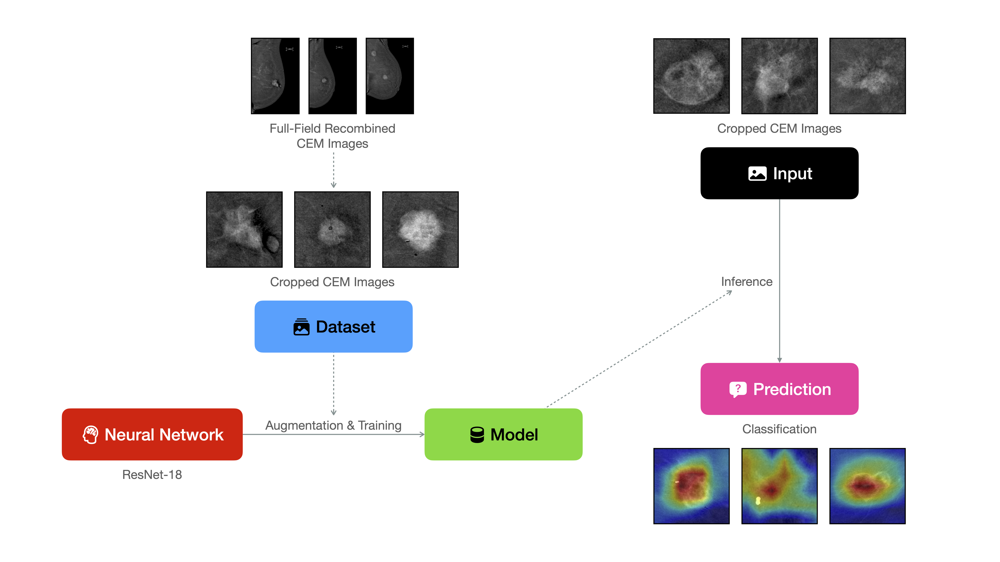
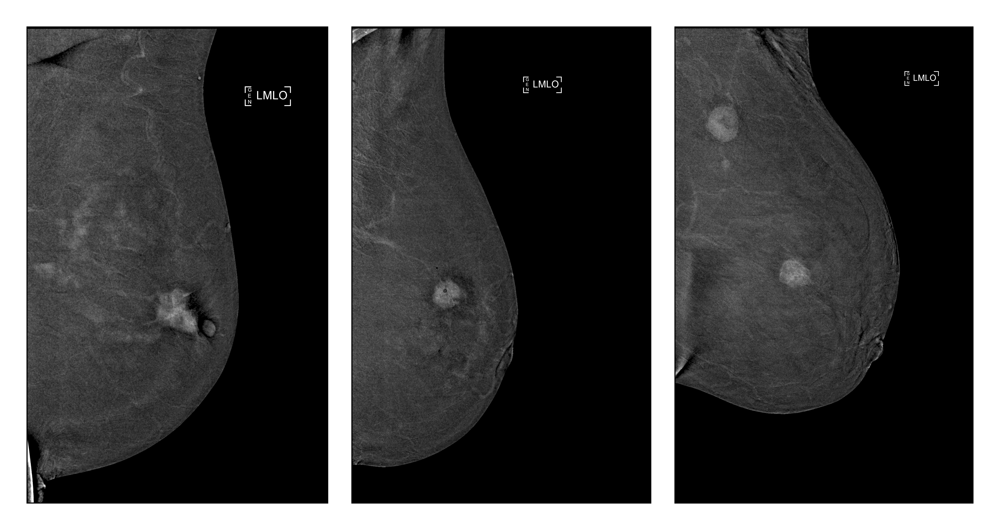
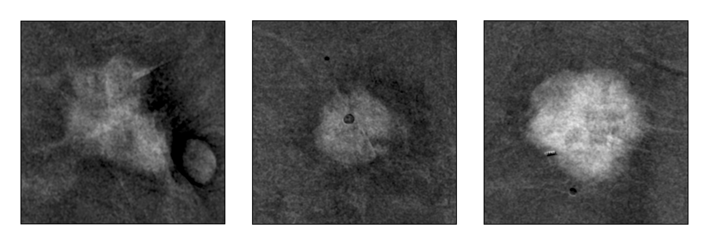
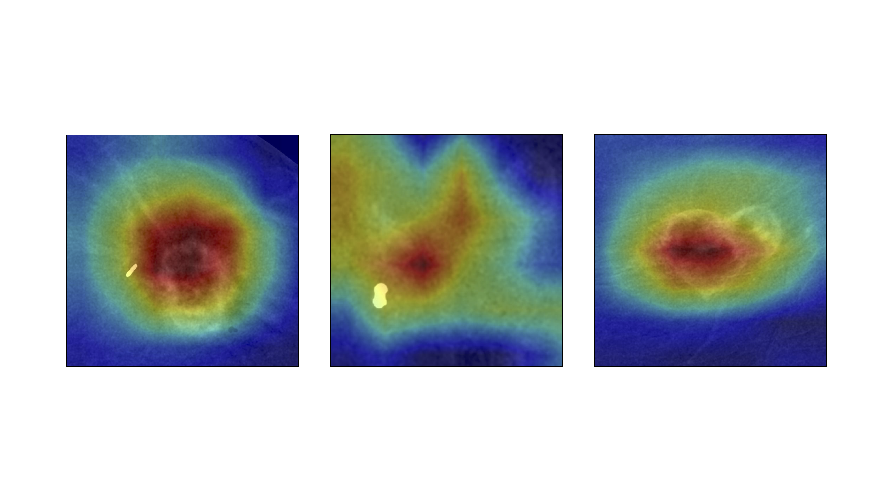

<!-- Convert with: "pandoc PAPER.md --filter pandoc-crossref --citeproc --reference-doc=word_template.docx -o paper.docx -N" -->

<!-- Convert removing images and tables and exporting tables with: "pandoc PAPER.md --filter pandoc-crossref --lua-filter filter-table-exporter.lua --citeproc --reference-doc=word_template.docx -o paper.docx -N --lua-filter filter-ast-target.lua" -->

**Abstract:**

**Background**: Hormone-receptor (HR) status steers systemic therapy in breast cancer but is currently obtained invasively. Contrast-enhanced mammography (CEM) might offer a non-invasive surrogate if coupled with deep learning. This study investigates this potential using patient-level data splitting to prevent information leakage.

**Methods**: Cropped tumour regions from CEM images of 105 women with biopsy-proven invasive cancer were used. Patients were randomised into a training set (68 patients, 249 images), a validation set (16 patients, 61 images) and an independent-test set (21 patients, 74 images). A ResNet-18—pre-trained on ImageNet and fine-tuned with weighted cross-entropy and an Adam optimizer—was trained for 30 epochs. The model achieving the highest validation area under the precision-recall curve (PR-AUC) was selected, and its output probabilities were calibrated using temperature scaling on the validation set. Performance was reported with accuracy, AUC-ROC and imbalance-aware metrics (balanced accuracy, Matthews correlation coefficient [MCC]); 95 % confidence intervals (CI) were obtained by 1000-iteration bootstrap. Results are presented for both a standard 0.5 threshold and an optimized threshold (maximizing F1-score for the HR-negative class on the validation set).

**Results**: On the training set, the selected model achieved a PR-AUC of 0.9279 (0.8961–0.9544) using the optimized threshold. Validation PR-AUC (the model selection metric) was 0.6402 (0.3044–0.9056). On the independent-test set, using the optimized threshold (0.755), the network achieved 91.89 % accuracy (86.49–97.30 %), AUC-ROC 0.8078 (0.6482–0.9351), balanced accuracy 0.7000 (0.5500–0.8530) and MCC 0.6047 (0.2961–0.8181).

**Conclusion**: A ResNet-18 fine-tuned with appropriate handling of class imbalance and utilizing patient-level data splitting can capture CEM features related to HR status, performing well even under pronounced class imbalance. The patient-level split provides a robust estimate of generalisability. Small single-centre size and the mixture of early and late CEM phases still limit generalisability; larger multi-institution cohorts are required.

**Keywords**: Breast Cancer, Deep Learning, Contrast-Enhanced Mammogra-phy, Artificial Intelligence, Precision Medicine.

**Abbreviations**: AI (Artificial Intelligence); AUC (Area Under the Curve); AUC-ROC (Area Under the Receiver Operating Characteristic curve); CC (Craniocaudal); CEM (Contrast-Enhanced Mammography); CI (Confidence Interval); CNN (Convolutional Neural Network, plural: CNNs); ER (Oestrogen Receptor); Grad-CAM (Gradient-weighted Class Activation Mapping); HER2 (Human Epidermal growth factor Receptor 2); HR (Hormone Receptor); MCC (Matthews Correlation Coefficient); MLO (Mediolateral-Oblique); MRI (Magnetic Resonance Imaging); PAM50 (Prediction Analysis of Microarray 50); PR (Progesterone Receptor); PR-AUC (Area Under the Precision-Recall Curve); ResNet-18 (Residual Network 18); ROI (Region Of Interest, plural: ROIs); WHO (World Health Organization).

**Key points:**

*   ResNet-18 predicted HR positivity on CEM with 91.9 % accuracy and AUC-ROC 0.81 in an independent-test cohort using an F1-optimized threshold and patient-level splitting.
*   Balanced accuracy (0.70) and MCC (0.60) demonstrate maintained discrimination despite an approximate 85 % class imbalance (HR-positive cases).
*   Patient-level splitting was employed to ensure robust evaluation. Limitations related to the dataset's scope and specific imaging protocols may influence broader generalizability.

**Relevance statement:**

This work explores whether routinely acquired CEM images contain enough information for deep-learning prediction of hormone-receptor status, aiming at a less invasive complement to biopsy. A ResNet-18 was trained with weighted loss and patient-level data splits; performance was quantified with imbalance-aware metrics to provide a realistic assessment in a highly skewed dataset, highlighting both the promise and current constraints of CEM-based molecular imaging.

## Introduction

Breast cancer is the most frequently diagnosed malignancy worldwide, with about 2.3 million new cases and 670 000 deaths in 2022 according to the latest WHO fact-sheet [@world_health_organization_breast_nodate]. Because the disease is biologically heterogeneous, expression of the oestrogen (ER) and progesterone (PR) receptors—summarised as hormone-receptor (HR) status—remains a pivotal determinant of systemic-treatment strategy and prognosis [@harbeck_breast_2017]. HR status is routinely assessed on tissue obtained by core biopsy or surgery, but this invasive approach is time-consuming, prone to sampling error and limited in its ability to capture spatial heterogeneity [@viale_current_2012; @bedard_tumour_2013]. A rapid, image-based surrogate could therefore complement or, in selected scenarios, reduce the need for tissue sampling.

Contrast-enhanced mammography (CEM) merges dual-energy X-ray acquisition with an iodinated contrast bolus, highlighting lesion vascularity in a workflow that is faster and more widely available than MRI. Early clinical series reported higher sensitivity for lesion detection, particularly in dense breasts [@lobbes_contrast_2013; @fallenberg_contrast-enhanced_2014], and recent reviews underline continued technical progress together with the emerging role of artificial-intelligence (AI) tools in CEM interpretation [@sorin_deep_2025; @covington_state_art_2024].

Concurrently, deep learning—especially convolutional neural networks (CNNs)—has transformed medical-image analysis. Surveys document expert-level performance across radiology domains [@litjens_survey_2017]; ResNet and related architectures are now de-facto baselines for image-classification tasks [@he_deep_2016], and have already improved breast-cancer risk prediction on screening mammography [@yala_deep_2019]. Several groups have extended these methods to molecular profiling. Zeng et al. predicted ER, PR and HER2 expression from digital mammograms (AUC up to 0.80) [@zeng_assessment_2025]. Huang et al. and Ming et al. used dynamic-contrast MRI radiomics or multi-scale CNNs to distinguish luminal from non-luminal cancers or to infer PAM50 subtypes [@huang_application_2023; @ming_predicting_2022]. Within the smaller CEM literature, Fanizzi et al. proposed a radiomics-based malignancy detector [@fanizzi_fully_2019]; Marino et al. applied texture analysis for molecular-subtype differentiation [@marino_contrast-enhanced_2020]; and Dominique et al. trained a CheXNet-based deep learning model on cropped regions from CEM images to classify various histoprognostic factors, including Estrogen Receptor (ER) and Progesterone Receptor (PR) status, as well as triple-negative phenotype [@dominique_deep_2022].

Collectively, these investigations have moved the field forward but share several limitations: they are predominantly single-centre, rely on modest sample sizes, and often exhibit pronounced class imbalance. They also typically report only accuracy and AUC without imbalance-aware metrics such as balanced accuracy or the Matthews correlation coefficient.

To provide a transparent benchmark that explicitly addresses class imbalance and ensures robust generalization estimates, we evaluate a ResNet-18 for HR prediction from CEM in a single-centre proof-of-concept study. Tumour regions are manually cropped to isolate lesion-specific signal while keeping preprocessing minimal. Model performance is reported with conventional metrics (accuracy, AUC-ROC) and imbalance-aware measures (balanced accuracy, MCC) to reflect the ≈ 85 % prevalence of HR-positive cases. Crucially, data splitting is performed at the patient level. Although preliminary and single-centre, the work establishes a reproducible reference point for subsequent multi-institution investigations.

## Materials and Methods

### Study design and ethics
This retrospective, single-centre feasibility study was approved by the institutional ethics committee. The overall study pipeline is illustrated in @fig:overview. All 105 women analysed had previously provided written consent for anonymised research use of their imaging and pathology data.

{#fig:overview}

### Patient cohort
Women who underwent contrast-enhanced mammography (CEM) between October 2020 and May 2022 for pre-operative staging of biopsy-proven invasive breast cancer were screened. Departmental policy restricts CEM to patients aged ≥ 30 years, so younger women are absent. All tumours were clinical stage T1–T2 at presentation. Contra-indications to CEM (pregnancy, breast implants, impaired renal function, severe contrast reaction) preclude referral and are therefore not represented.

Hormone-receptor (HR) status was copied verbatim from each pathology report. A case was labelled HR-positive when either ER or PR was marked “positive” by the institutional pathology service. HR-negative was considered the positive class (minority class, label '1') for metrics like PR-AUC and for threshold optimization, due to its clinical significance in guiding therapy away from endocrine treatments. Because the exact immunohistochemical threshold was not recorded consistently, a degree of uncertainty in the reference standard is acknowledged.

### CEM protocol
Imaging was performed on a Hologic Selenia Dimension system. After intravenous iodinated contrast (Iomeron 350, 1.5 mL kg⁻¹; maximum 110 mL) at 2–3 mL s⁻¹, dual-energy two-dimensional craniocaudal (CC) and mediolateral-oblique (MLO) views of the affected breast were acquired 2 minutes post-injection.

Because the dataset is small, late low-dose images acquired 7 minutes after contrast injection were also retained. The impact of mixing early and late phases is unknown and is considered a limitation. Only recombined (subtracted) images of the tumour-bearing breast were analysed (representative examples shown in @fig:raw-cems); low-energy images and all contralateral views were excluded.

Images included in the analysis were those deemed clinically acceptable at the time of acquisition; however, a formal secondary review for subtle artifacts or image quality scoring specifically for this research study was not performed.

{#fig:raw-cems}

### Region-of-interest definition and preprocessing
Enhancing lesions were localised on the recombined images and cropped manually with the workstation viewer (no external annotation software, no mirror-padding). Each rectangular crop covered the lesion and a small rim of surrounding tissue; multifocal tumours were cropped separately. The precise extent of the surrounding tissue and the approach in cases of very high or heterogeneous background parenchymal enhancement were based on the operator's judgment to best encompass the visible lesion, which may introduce some variability.

The resulting manually cropped ROIs (examples provided in @fig:cropped-rois) served as the input images for the model. These input images were converted to 3-channel grayscale. During training, crops were fed to a `RandomResizedCrop((224,224))` layer, followed by `RandomHorizontalFlip`, `RandomRotation(15)`, and `ColorJitter(0.1,0.1)`. Validation and test images underwent `Resize(256)` and `CenterCrop((224,224))`. All images were normalised to the ImageNet mean and standard deviation.

{#fig:cropped-rois}

### Dataset split
From the 105 patients (88 HR-positive, 17 HR-negative), 384 images were derived. Patients were randomly assigned, stratified by HR status, to a training set (68 patients: 57 HR-positive, 11 HR-negative; yielding 249 images: 213 HR-positive, 36 HR-negative), a validation set (16 patients: 13 HR-positive, 3 HR-negative; yielding 61 images: 52 HR-positive, 9 HR-negative) and an independent-test set (21 patients: 18 HR-positive, 3 HR-negative; yielding 74 images: 64 HR-positive, 10 HR-negative). HR-positive cases comprised ~85 % of patients in every subset. This patient-level split ensures that images from the same patient do not appear in multiple subsets, mitigating information leakage. While this stratification aimed to balance the primary outcome, a detailed characterization of other clinical or imaging features (e.g., tumor size, grade, background enhancement) across the splits was beyond the scope of this preliminary study and represents a potential source of unassessed variability.

### Convolutional-network architecture and training
A ResNet-18 pretrained on ImageNet served as backbone. The choice of ResNet-18, a relatively less complex architecture, was deemed appropriate for the modest dataset size to mitigate overfitting while still benefiting from powerful pre-trained features. The entire network was fine-tuned to adapt these features specifically to the CEM image domain and the HR status prediction task. The original fully connected layer was replaced by a single linear layer mapping ResNet-18's 512 features to 2 (number of classes). The entire network was fine-tuned.

Training used the Adam optimiser with an initial learning rate of 1 × 10⁻⁵ and weight-decay of 5 × 10⁻⁴. The small initial learning rate was chosen to facilitate stable fine-tuning of the pre-trained weights. A ReduceLROnPlateau scheduler reduced the learning rate by a factor of 0.1 after seven epochs without improvement in validation PR-AUC (HR-negative as positive class), allowing for adaptive adjustments during training. The loss function was weighted cross-entropy (weights 1.0 for HR-positive, 2.5 for HR-negative), in order to address the pronounced ~85% class imbalance by compelling the model to pay greater attention to the minority HR-negative class; mini-batch size was 4; and training ran for up to 30 epochs. Training and validation loss, as well as training and validation PR-AUC, were recorded at each epoch. The network snapshot that achieved the highest validation PR-AUC was retained. Following training, the model's output probabilities were calibrated using temperature scaling, with the temperature parameter optimized on the validation set logits.

### Performance metrics and statistical analysis
Performance on the training, validation and independent-test sets was summarised with: accuracy, specificity (recall for HR-positive), area under the precision-recall curve (PR-AUC, HR-negative as positive class), balanced accuracy, Matthews correlation coefficient (MCC) and the area under the receiver-operating-characteristic curve (AUC-ROC). Precision, recall, and F1-score for both HR-positive and HR-negative classes were also calculated. Ninety-five-percent confidence intervals (95 % CI) were calculated with 1000-iteration non-parametric bootstrap. An optimal classification threshold was determined on the validation set by maximizing the F1-score for the HR-negative class, and performance on all sets is reported using this optimal threshold alongside the standard 0.5 threshold. No hypothesis tests or p-values are reported, as only a single model was evaluated.

### Implementation and hardware
The pipeline is implemented in Python with PyTorch; full requirements and source code are available on GitHub (link in the Data-availability statement). Experiments ran on an Apple M2 laptop with 8 GB unified memory via the Metal Performance Shaders backend; the script automatically falls back to CUDA GPU or CPU if available. Temperature scaling was used for probability calibration. Grad-CAM was used to generate activation heatmaps for model interpretability.

## Results

### Training behaviour
The training process over 30 epochs is illustrated in @fig:train-hist. Weighted cross-entropy loss for the training set generally decreased from an initial 0.6599 (epoch 1) to 0.4803 at epoch 30. Validation loss showed more fluctuation but ended at 0.5877 at epoch 30, having started at 0.8652 (epoch 1) and experiencing some peaks (e.g., 1.2886 at epoch 4) (@fig:train-hist (A)).

Training PR-AUC (HR-negative as positive class) showed a general upward trend, increasing from 0.5459 at epoch 1 to 0.8296 by epoch 30 (@fig:train-hist (B)). The validation PR-AUC, the primary criterion for model selection, fluctuated throughout training, achieving its maximum value of 0.6402 at epoch 30 (@fig:train-hist (B)). Consequently, the model checkpoint from epoch 30 was selected for final evaluation. Post-training, temperature scaling was applied to this model using the validation set, resulting in an optimal temperature of 1.386. This epoch-specific training PR-AUC of 0.8296 reflects the metric as tracked during the training process for model selection purposes; the performance of this final selected and calibrated model on the full training set using the optimized threshold is reported in @tbl:results as 0.9279. The ReduceLROnPlateau scheduler did not trigger a learning rate reduction during these 30 epochs.

{#fig:train-hist}

### Final model performance
An optimal classification threshold of 0.755 was determined from the validation set based on maximizing the F1-score for the HR-negative class. @tbl:results presents the discrimination results with 95 % bootstrap confidence intervals for the training, validation, and independent-test sets, comparing performance using a standard 0.5 threshold and this optimal threshold.

The modest gap between overall accuracy and balanced accuracy on the test set with the optimal threshold (91.9% vs 70.0%) highlights that while overall correct classification is high, performance on the minority class (HR-negative, recall 0.40 with optimal threshold, see full results for details) is more limited, as expected with high class imbalance, despite weighted loss and threshold optimization. Specificity (recall for HR-positive, the majority class) was 1.0000 on the test set with the optimal threshold.

| Metric              | Training (0.5 th.)       | Training (opt th. 0.755) | Validation (0.5 th.)     | Validation (opt th. 0.755)| Test (0.5 th.)           | Test (opt th. 0.755)      |
|---------------------|--------------------------|---------------------------|--------------------------|---------------------------|--------------------------|---------------------------|
| Accuracy            | 0.7871 (0.7348–0.8354)   | 0.7068 (0.6466–0.7671)    | 0.6557 (0.5246–0.7705)   | 0.9180 (0.8361–0.9836)    | 0.6216 (0.5000–0.7297)   | 0.9189 (0.8649–0.9730)    |
| Balanced accuracy   | 0.7876 (0.7328–0.8383)   | 0.7126 (0.6709–0.7566)    | 0.6603 (0.4681–0.8359)   | 0.7682 (0.6049–0.9403)    | 0.7391 (0.6026–0.8359)   | 0.7000 (0.5500–0.8530)    |
| MCC                 | 0.5755 (0.4687–0.6769)   | 0.5158 (0.4437–0.5922)    | 0.2327 (-0.0414–0.4824)  | 0.6387 (0.3199–0.8950)    | 0.3270 (0.1318–0.4908)   | 0.6047 (0.2961–0.8181)    |
| AUC-ROC             | 0.8647 (0.8169–0.9080)   | 0.9033 (0.8634–0.9393)    | 0.7821 (0.5667–0.9709)   | 0.7821 (0.5667–0.9709)    | 0.8078 (0.6482–0.9351)   | 0.8078 (0.6482–0.9351)    |
| PR-AUC (HR-neg)     | 0.8838 (0.8370–0.9241)   | 0.9279 (0.8961–0.9544)    | 0.6402 (0.3044–0.9056)   | 0.6402 (0.3044–0.9056)    | 0.5817 (0.2754–0.8267)   | 0.5817 (0.2754–0.8267)    |

Table: Performance metrics for the final ResNet-18 model on all data subsets, comparing a standard 0.5 classification threshold and the optimized threshold (0.755, F1-tuned on validation set for HR-negative class). Values are point estimates followed by 95 % confidence intervals. PR-AUC is for the HR-negative class. {#tbl:results}

@fig:gradcam shows Grad-CAM visualisations for representative cases, illustrating that network attention generally overlaps the enhancing tumour region.

{#fig:gradcam}

### Computational aspects
Complete training (30 epochs) required approximately 10 minutes on an Apple M2 laptop with 8 GB unified memory. Inference time per image was not formally measured.

## Discussion

In this retrospective proof-of-concept we show that a ResNet-18,  trained with patient-level data splits, weighted loss, and with post-hoc probability calibration, achieves 91.9 % accuracy and an AUC-ROC of 0.81 on an independent-test set (using an F1-optimized threshold of 0.755) when predicting hormone-receptor (HR) status. Reporting balanced accuracy (0.70) and Matthews correlation coefficient (0.60) alongside conventional metrics provides additional insight into model behaviour under the pronounced class imbalance (~85 % HR-positive). The use of patient-level splitting in this study ensures reliable estimates of model performance.

Placing these findings alongside existing literature requires careful consideration of methodological differences. Exploring CEM-based molecular characterization, Marino et al. [@marino_contrast-enhanced_2020] employed radiomics analysis and reported 78.4% accuracy for differentiating HR positive from HR negative cancers, evaluated using leave-one-out cross-validation. This contrasts with our deep learning approach and evaluation methodology, making direct metric comparison challenging.

More recently, Dominique et al. [@dominique_deep_2022], in a larger study of 389 patients, also used deep learning on cropped CEM images, reporting an AUC of 0.83-0.85 for Estrogen Receptor (ER) prediction. Our study focused on the combined HR status (ER or PR positive) within a cohort of 105 patients.

Looking at predictions from other modalities, Zeng et al. [@zeng_assessment_2025] developed a deep learning model for standard, non-contrast mammography that achieved an AUC of 0.785 for ER prediction without manual segmentation of masses. Our use of CEM provides contrast-related information, and our model was trained on manually cropped tumor regions, highlighting different approaches to image input and feature extraction.

These comparisons underscore that while the field is advancing, variations in patient cohorts, specific molecular targets (e.g., ER alone vs. combined HR), imaging modalities or techniques (e.g., CEM vs. standard mammography; DL vs. radiomics), input data processing (e.g., cropped vs. unsegmented), and evaluation methodologies make direct performance benchmarking complex.

Our study aimed to contribute a transparent reference point by employing a comprehensive methodology. The reported performance reflects the use of a ResNet-18 fine-tuned with weighted cross-entropy to address class imbalance, post-hoc probability calibration using temperature scaling, and an F1-optimized classification threshold. Evaluation was performed using patient-level data splitting to ensure robust generalization estimates on an independent test set, with performance quantified using conventional and imbalance-aware metrics (balanced accuracy, MCC) to provide a realistic assessment, particularly given the pronounced class imbalance inherent in HR status prediction.

Several considerations temper the interpretation of our findings. First and foremost, the study draws on a small, single-centre cohort (105 patients), which inherently limits external validity. Broader generalizability may also be affected by differences in CEM acquisition protocols (e.g., acquisition timing, injection rate, detector technology) that can vary between institutions.

Second, specific aspects of the dataset and its processing introduce potential variability. The manual ROI delineation, particularly in the presence of variable background enhancement, relied on operator judgment and could introduce variability not explicitly quantified in this study; this is a consideration even though patient-level randomization was employed to ensure robust overall evaluation. Furthermore, the dataset was augmented by retaining late low-dose images (acquired seven minutes after contrast injection in addition to standard two-minute images) to enlarge it; the influence of mixing these imaging phases is unknown but may have introduced unwanted variation. Additionally, lesion patches were resized with `RandomResizedCrop` during training, which can subtly stretch or compress the tumour, and the impact of this variable aspect ratio has not been quantified.

Third, the reference standard itself has limitations. Hormone receptor (HR) labels were copied verbatim from pathology reports without a uniform immunohistochemical threshold, potentially introducing label noise.

Finally, the scope of this work means that no parallel analysis of MRI or ultrasound was performed, so the relative diagnostic contribution of CEM cannot be inferred.

Despite these limitations, the study provides a transparent baseline for HR-status prediction from CEM and underscores the value of imbalance-aware reporting and rigorous data splitting methodologies. Future research should incorporate multi-institution cohorts, harmonised acquisition protocols, automatic lesion localisation, consensus pathology thresholds and direct modality comparisons to clarify the clinical role of CEM-based deep learning in molecular characterisation.

## Conclusion

A ResNet-18 convolutional neural network, fine-tuned with weighted loss and employing patient-level data splits, can extract informative features from contrast-enhanced mammography. In this study, following calibration of its output probabilities and application of an F1-optimized threshold, it predicted hormone-receptor status with 91.9 % accuracy and an AUC-ROC of 0.81 on an independent-test set. The accompanying balanced accuracy of 0.70 and Matthews correlation coefficient of 0.60 indicate that the model retains discriminative value despite a markedly skewed class distribution, although performance on the minority class remains a challenge. These results, achieved with minimal preprocessing and standard architecture, confirm the presence of biologically relevant signal in CEM images.

Interpretation, however, must remain cautious. The dataset is small and originates from a single institution; late-phase images were mixed with standard early images; variable aspect ratios were introduced during cropping; and pathology reports provided HR labels without a uniform immunohistochemical threshold. Each of these factors can influence performance estimates. A key aspect of this study is the use of patient-level splitting, which provides more trustworthy performance estimates.

Even so, the study offers a transparent baseline and emphasises the importance of reporting imbalance-aware metrics and employing sound validation strategies in molecular-imaging AI. Extending this work to multi-centre cohorts, harmonised CEM protocols, patient-level splits and automatic lesion localisation will be essential next steps toward assessing whether CEM-based deep learning can contribute meaningfully to non-invasive tumour characterisation in clinical practice.

## Bibliography
<!-- This section will be automatically generated -->